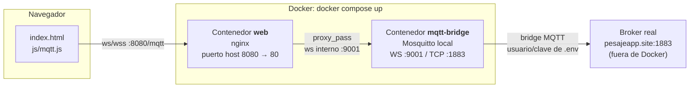

# DARIZA SCADA IOT

Panel HMI web para monitoreo y control de bombas vía MQTT.

## Arquitectura: cómo está interconectado con MQTT

El navegador **no puede hablar MQTT-TCP directo** (solo sabe usar WebSocket), pero el
broker real (`pesajeapp.site`) solo expone MQTT-TCP plano en el puerto `1883`, sin
WebSocket. Por eso hay un "traductor" en el medio: un Mosquitto local
(`mqtt-bridge`) que habla WebSocket con el navegador y, por detrás, se conecta como
cliente normal al broker real vía un **bridge** (reenvío nativo de Mosquitto, sin
código custom) que copia todo lo que pasa por el topic `lurin/factory/bombas/#` en
ambos sentidos.



- El navegador entra por `http://localhost:8080` y abre WebSocket a `/mqtt` en el
  **mismo host/puerto** de la página (`js/config.js` arma la URL solo, no hay que
  tocarla si no cambias el puerto).
- nginx (contenedor `web`) reenvía ese WebSocket al contenedor `mqtt-bridge`.
- `mqtt-bridge` es Mosquitto corriendo **solo para traducir** — no reemplaza tu
  broker real, solo le hace de puente para que el navegador pueda llegar a él.
- El bridge se autentica contra `pesajeapp.site` usando las credenciales de `.env`
  (nunca viajan al navegador).

## Si quieres cambiar el puerto (u otra config)

Depende de **cuál** puerto:

| Quiero cambiar... | Edito... |
|---|---|
| El puerto en el que abres la web desde tu PC (ahora `8080`) | `docker-compose.yml`, servicio `web` → `ports: "NUEVO:80"` |
| El host/puerto/usuario del **broker real** | `.env` (`MQTT_REMOTE_HOST`, `MQTT_REMOTE_PORT`, `MQTT_REMOTE_USER`, `MQTT_REMOTE_PASS`) |
| Los topics MQTT (`lurin/factory/bombas/...`) | `js/config.template.js` (navegador) **y** `docker/mosquitto/mosquitto.conf.template` (bridge) — deben coincidir en ambos lados |
| El puerto interno del bridge (`9001`, uso interno, no lo tocas normalmente) | `docker/mosquitto/mosquitto.conf.template` **y** `docker/nginx/nginx.conf` (`proxy_pass`) a la vez |

Después de cualquier cambio: `docker compose up -d --build`.

## Estructura

```
index.html                          Pantallas (login, proceso, monitoreo, parámetros, diagnóstico)
css/styles.css                      Estilos
js/config.template.js               Plantilla del navegador (login, topics, URL del bridge) — se sube a git, SIN secretos
js/config.js                        Generado automáticamente a partir de config.template.js + .env (no existe en el repo)
js/ui.js                            Login, navegación entre pantallas, botones +/-
js/mqtt.js                          Conexión MQTT (al bridge), lectura de valores y botones de control
img/                                Logos e imágenes del esquema
manifest.json                       Manifest de la PWA

Dockerfile                          Imagen nginx que sirve el frontend
docker-compose.yml                  Servicios: web (nginx) + mqtt-bridge (Mosquitto)
docker/nginx/nginx.conf             Sirve la web + proxy WebSocket → mqtt-bridge en /mqtt
docker/nginx/40-generate-config.sh  Genera js/config.js desde la plantilla al arrancar el contenedor web
docker/mosquitto/mosquitto.conf.template   Config del bridge (sin secretos, se rellena con .env al arrancar)
.env                                TODAS las credenciales reales: login + broker MQTT (no se sube a git)
.env.example                        Plantilla de .env

test-data/simulador.py              Simulador de la bomba para pruebas locales (no entra a Docker)
test-data/var.json, io.json         Payloads MQTT de ejemplo para publicar a mano (MQTT Explorer)
```

## Cómo correrlo

**Con Docker (recomendado, incluye login y bridge MQTT funcionando):**

```bash
cp .env.example .env   # y pon ahí el login real y las credenciales del broker
docker compose up -d --build
```

Al arrancar, el contenedor `web` genera `js/config.js` a partir de
`js/config.template.js` reemplazando `__APP_USER__`/`__APP_PASS__` con lo que
pusiste en `.env`. Abre `http://localhost:8080`.

**Sin Docker (solo para ver la interfaz/maquetado):**

`js/config.js` no existe en el repo (se genera solo con Docker), así que sirviendo
la carpeta directo con `python3 -m http.server 8000` el login y el MQTT **no van a
funcionar** (falta `APP_USER`/`APP_PASS`/etc.). Si necesitas este modo, copia
`js/config.template.js` a `js/config.js` y reemplaza `__APP_USER__`/`__APP_PASS__`
a mano.

## Probar con datos falsos

```bash
cd test-data
python3 -m venv venv && ./venv/bin/pip install paho-mqtt
./venv/bin/python -u simulador.py
```

Publica datos de variadores/IO cada 2 segundos directo al broker real, y reacciona
a los comandos que la web manda (`variador1on`, `automatico`, `selectbomba1`, etc.).
Ver [test-data/simulador.py](test-data/simulador.py) para la lista completa de
comandos que entiende.

## Notas

- El login se valida en el navegador (JavaScript del cliente), por lo que no es un
  mecanismo de seguridad real: cualquiera puede ver el código fuente. Sirve solo
  para restringir el acceso casual.
- Ningún secreto debe vivir en `js/config.js` ni en ningún archivo servido al
  navegador — todo lo que se manda al cliente es visible con "Ver código fuente".
